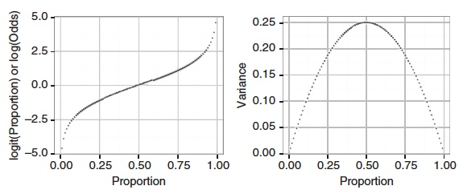
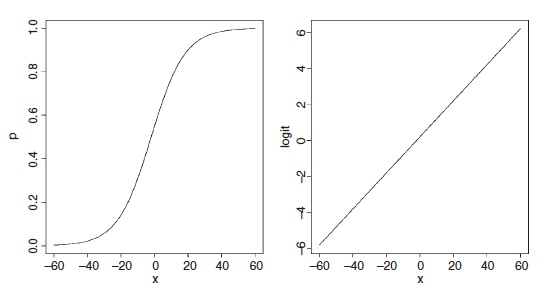

```{r setup, include=FALSE}
options(scipen = 1, digits = 2) #changes outputs to to decimal places.
knitr::opts_chunk$set(echo = TRUE)
packages_needed <- c("ggplot2", # graphics
                     "arm", # display() etc.
                     "ggfortify", # check model assumptions
                     "performance", # check model assumptions
                     "AICcmodavg", #average AIC models
                     "grid" #arrange objects
                     )
pk_to_install <- packages_needed [!( packages_needed %in% rownames(installed.packages())  )]
if(length(pk_to_install)>0 ){
  install.packages(pk_to_install,repos="http://cran.r-project.org")
}
#lapply(packages_needed, require, character.only = TRUE)
library(ggplot2)
library(arm)
library(ggfortify)
library(performance)
library(AICcmodavg)
library(grid)
```
Background: https://www.youtube.com/watch?v=zUxZ95IXTco


We introduced GLMs in Chapter 8. The key advance over least squares linear
models is that we can use the link and variance functions to model the
mean and variability separately. 

In our analysis of the timber hardness data (janka)
we used a square-root link function to linearize the relationship and the
gamma distribution to model the way in which the variance increased as a
function of the mean.

**Binary Data**: yes/no, live/die, pass/fail

GLMs are probably most useful with binary data (since no transformation
can make the residuals normal and least squares methods are
useless).

**Count Data**: whole integers; 0, 1, 2, 3 etc. and **binomial count**; eight deaths from twelve organisms (8 failures, 4 successes)

We will begin with a small data set from an experiment looking at the
mortality of batches of the flour beetle *Tribolium confusa* exposed to different doses of a pesticide (carbon disulphide).

```{r Beetle Binomial}
data(beetle) # from AICcmodavg
beetle$Number_survived <- beetle$Number_tested - beetle$Number_killed
```

When binomial count data are expressed as proportions, the mean must
asymptote towards zero (the minimum possible value) and one (the maximum),
and this floor and ceiling also constrain the variance. This means
we would expect to need some sort of ‘S-shaped’ relationship to model the
mean while the variance will decrease towards both extremes (0,1) and be
greatest in between.

**The default (canonical) link function in binomial GLMs is the logistic transformation.**



The logistic transformation converts proportions to logits. ***Logits are the natural log of the odds and the odds are the ratio of successes to failures.*** If we had a binomial denominator of ten with five successes to five failures then the logit would be log(5/5) = 0.



So why not simply use the logit transformation and analyse the resulting logits with a normal least squares regression? Because the variance is not constant: as we said it is larger at intermediate proportions and decreases towards both extremes. Instead we use a binomial variance function to model the variability.

We use the **family** argument to specify the **binomial** distribution
(for which the logistic is the default link function). The logistic
link function and binomial distribution take account of the properties and constraints on the pattern of the mean and variance for binomial count data.

```{r}
m1 <- glm(cbind(Number_killed, Number_survived) ~ Dose, data= beetle, family= binomial)
```

```{r}
#wr <- glm(Mortality_rate~Dose, data= beetle, family= binomial, weight= Number_tested)
#alternative by weighted regression
```

```{r message=FALSE, warning=FALSE}
ggplot(beetle, aes(Dose,Mortality_rate)) +
  geom_point() +
  geom_smooth(method="glm", method.args=list(family="binomial"(link="logit")), se=FALSE)+
  geom_hline(yintercept = mean(beetle$Mortality_rate), linetype = "dashed") +
  labs(title="GLM, binomial count (live/die)")
```

The proportion of beetles killed (Mortality rate) as a function of increasing
concentration of carbon disulphide (Dose).The CI for the slope does not contain zero, supporting an increasing probability of mortality as dose increases, as we would expect.

```{r}
coef(m1)
confint(m1)
```
***The logistic curve is linear on the logit scale*** and the coefficients are the regression intercept (14.6) and slope (0.25) of this line. The `summary()` function output gives the same result in a slightly different form. Lets check the assumption that the ratio of the residual deviance to the residual DF (which R calls the **dispersion parameter**) is approximately 1:1. In this case it is a little higher (8.43/6=1.4), as we can see from the last line of the `summary()` function output:

```{r}
summary(m1)
```
This overdispersion is not too substantial but we can account for it by
using the closely related approach of quasi-maximum likelihood. If we
alter the family to **quasi-binomial** then instead of being assumed (and
underestimated), the level of variation will be estimated from the data and
the standard errors increased accordingly.

```{r}
mq1 <- glm(cbind(Number_survived, Number_killed) ~ Dose, data= beetle, quasibinomial)
summary(mq1)
```

Notice how the standard errors of the quasibinomial are increased compared with those from the binomial GLM to take account of the overdispersion.

However, one disadvantage of quasi-maximum likelihood is that because we have a quasi-likelihood rather than a true likelihood we are not given a value for the Akaike information criterion (AIC; although, as we will see later, some
statisticians are willing to calculate quasi-AIC values and there are R packages that provide them, including the `AICcmodavg` package used here).
\
\
\
**Summary: Binomial Count Data**

* use of the `glm()` function for analysing binomial count data illustrated how we have to bind together the successes and failures for the response variable and specify the binomial distribution using the `family` argument.

* We can check whether the level of variability is as assumed by the binomial distribution model and inflate the standard errors to account for any overdispersion using a quasi-maximum likelihood approach.
\
\
\
**Binary Data**

Binary data are an extreme form of binomial count data in which the binomial
denominator is equal to one, so that every trial produces a value of
either one or zero. Binary data can therefore be analysed using a GLM with
a binomial distribution and the same choice of link functions to prevent
predictions going below zero or above values of one.

However, despite the use of the same distribution and link functions, because of the constrained nature of the data there are some differences in the analysis of binomial counts. For one thing, the use of the ratio of the residual deviance to residual DF to diagnose over- or underdispersion does not apply. We use `arm` package `binnedplot()` function instead for model checking.

Example:  The binary response examining whether or not people switch the well from which they get their drinking water in relation to the level of arsenic and the distance to the nearest safe well. 1=safe level of arsenic, 0=unsafe level.

```{r Wells: Chart to see raw fit}

wells <- read.csv("data/Binary_Wells.csv")
ggplot(wells,aes(dist,switch)) +
  geom_point() +
  geom_smooth() +
  xlab ("Distance to Nearest Well") +
  ylab ("Probability of Switching") +
  labs(title="Raw Fit: 1=safe level of arsenic, 0=unsafe level")
```

It looks like the probability of switching declines with distance, as we
would expect (Fig. 9.2). Before we fit the GLM we can avoid inconveniently
small coefficient values by rescaling distance in hundreds of meters.

```{r Figure 9.3}
wells$dist100 <- wells$dist/100
fit.1 <- glm(switch~dist100, data=wells, binomial(link="logit"))
autoplot(fit.1) #uses ggfortify
#performance::check_model(fit.1)
```

The logistic link function is the default for the binomial variance function.
With a normal least squares analysis we could use the automatic diagnostic
plots to examine the residuals but **the constrained nature of binary data
makes them of little if any use** (Fig. 9.3).

As already mentioned, we cannot use the ratio of the residual deviance to
residual DF to look for overdispersion as we do with binomial counts (and
Poisson GLMs). Luckily the `arm` package provides the `binnedplot()` function
that offers a graphical approach.

```{r Figure 9.4}
library(arm)
x <- predict(fit.1)
y <- resid(fit.1)
binnedplot(x, y)
```

The grey lines in the plot indicate ±2 standard errors, within which approximately 95% of the binned residuals are expected to fall.

```{r coefficients fit.1}
coef(fit.1)
confint(fit.1)
```
It does indeed seem to be the case that the further away an alternative well
is, the less likely people are to switch to it.

Gelman and Hill promote a [rough rule of thumb for interpreting the slope of the logistic regression](http://econometricsense.blogspot.com/2016/05/divide-by-4-rule-for-marginal-effects.html): the ‘divide by four rule’. Dividing the slope coefficient for the logistic regression slope by four will give us an approximate estimate for the maximum predicted effect on the response of a unit change in the predictor.

In this case, a difference in distance of 100 m corresponds to a decrease in the probability of switching of 15% since –0.62/4 = –0.15. The figures show the average probability of switching with a 95% CI.

```{r Figure 9.5}
ggplot(wells, aes(dist,switch)) +
  geom_point() +
  geom_smooth(method="glm", method.args=list(family="binomial"(link="logit"))) + 
  xlab ("Distance to Nearest Well") +
  ylab ("Probability of Switching")
```

We can look at the effect of arsenic concentration in a similar way:
```{r}
fit.2 <- glm(switch~arsenic, binomial(link="logit"), data= wells)
arm::display(fit.2)
```
Once again, the estimates are in logits with a clear positive effect of increasing
arsenic concentration on the probability of switching wells, as expected.
```{r Figure 9.6}
ggplot(wells, aes(arsenic,switch)) +
         geom_point() +
         geom_smooth(method="glm", method.args=list(family="binomial"(link="logit"))) + 
         xlab ("Arsenic Concentration ug/Liter") +
         ylab ("Probability of Switching")
```
\
\
Lets look at **Arsenic concentration** AND **Distance to a Safe Well** in the same model; this way we can also test for interaction effects to see if there is a trade off.

Before fitting the GLM we can make life easier by *centering the explanatory variables by subtracting their mean value*. This has advantages when a regression intercept of zero is unhelpful or makes no sense (as with a distance of zero meters here—if we took this literally the new and old well would be in the same place) and when examining interactions:

```{r Centering and Interaction}
wells$c.dist100 <- wells$dist100 - mean(wells$dist100)
wells$c.arsenic <- wells$arsenic - mean(wells$arsenic)
fit.5 <- glm(switch~c.dist100+c.arsenic+c.dist100:c.arsenic,
binomial, data= wells)
arm::display(fit.5) # model numbering from Gelman and Hill
```
The coefficients are all given on the **logit scale**. <span style="color:blue">Back-transforming the estimate for the intercept (using the `invlogit()` function displayed below) gives the probability of switching</span>—because we have centered both variables this is the probability of switching at average arsenic levels and average distance to the nearest safe well:

```{r invlogit function}
invlogit <- function(x) {1 / ( 1+exp(-x) ) } 
invlogit(coef(fit.5)) #for interpreting centered data only?
exp(coef(fit.5)) #more books say use exponential; maybe only for poisson
```
The probability of switching at average arsenic levels and average distance
to the nearest safe well is **`r invlogit(coef(fit.5))[1]`**.

**c.dist100** The effect of a change of 100 m when arsenic is at average levels is **-0.87** change in the log-odds (logit). (proportion = 0.29)

**c.arsenic** The effect of a unit change (1 ug/L) in arsenic for a well at average distance is **0.47** change in the log-odds (logit). (proportion = 0.62)

**c.dist100:c.arsenic** For every increase of 100 m we add **–0.18** to the log-odds for arsenic. This means that the effect of the level of arsenic declines with distance to the
nearest well. Similarly, for every unit increase in arsenic we add **–0.18** to the log-odds for distance. In other words the higher the arsenic levels the less important the distance to the nearest safe well. (proportion = 0.46)

So far we have focused on effect sizes (intercepts and slopes), but what about P-values? 

The size of the estimated difference (–0.18) for the interaction is a
bit less than twice the standard error of the difference (0.1), so while it is
marginally significant it fails to meet the conventional 5% level (as you can
explore using the `confint()` function CIs, the `summary()` function Z-values,
or the likelihood ratio test produced by applying the `anova()` function to a
pair of models with and without the interaction).

```{r CIs to assess significance}
confint(fit.5)
summary(fit.5)
```

**Summary: Binary Data**

* We can analyse binary data using a binomial GLM. However, we do not use the ratio of the residual deviance to residual DF to diagnose over- or underdispersion.

* We can use the `binnedplot()` function from the `arm` package to examine the binned residuals

* Since the GLM uses the binomial distribution and the logit link function, the analysis is interpreted in a similar way to the GLM of binomial count data.

* In this case, the GLM of the binary wells data reveals a positive effect of arsenic concentration on the probability of switching wells and a negative effect of distance to the nearest safe well.

* There is a marginal negative interaction that suggests that each effect slightly reduces the effect of the other (the effect of distance to the nearest well is a bit reduced as arsenic concentration increases and the effect of arsenic concentration is slightly moderated as distance to the nearest safe well increases).
\
\
\
\
**Notes on Interpreting Logistic Coefficients** (Gelman and Hill 2006 and https://bookdown.org/jefftemplewebb/IS-6489/logistic-regression.html)

The  x  values, ranging from -6 to 6, are compressed by the inverse logit function into the 0-1 range. The inverse logit is curved, so the expected difference in  y  corresponding to a fixed difference in  x  is not constant. At low values and high values of  x  a unit change corresponds to very little change in  y , whereas in the middle of the curve a small change in  x  corresponds to a relatively large change in  y . In linear regression the expected difference in  y  corresponding to a fixed difference in  x  is, by contrast, constant. **Thus, when we interpret logistic results we must choose where on the curve we want to evaluate the probability of the outcome, given the model.**

Coefficients in logistic regression can be challenging to interpret because of the nonlinearity. There are three approaches that may work:

1. Evaluation at and near the mean of the data (`invlogit` at mean; Gelman and Hill p.81) Works for both categorical and continuous linear predictors to *probabilities*.

`invlogit`(coef(fit.1)[1] + coef(fit.1)[2]*mean(pred.variable))

`invlogit`(-1.40 + 0.33*mean(income))

Example; With mean income = 3.1, yielding *Pr(Bush support) = 0.40 at this central point (the mean)*.

2. The “divide by 4 rule”

As a rule of convenience, we can take logistic regression coefficients (other than the constant term) and divide them by 4 to get an upper bound of the *predictive difference corresponding to a unit difference in x*. This upper bound is a reasonable approximation near the midpoint of the logistic curve, where probabilities are close
to 0.5.

For example, in the model Pr(Bush support) = logit^-1(-1.40 + 0.33 · income), we can divide 0.33/4 to get 0.08: a difference of 1 in income category corresponds to no more than an 8% positive difference in the *probability* of supporting Bush.

3. Interpretation of coefficients as odds ratios (TBD).

Interpreting the slope coefficient in a binary GLM is a little bit mind bending. This might help:
https://quantifyinghealth.com/interpret-logistic-regression-coefficients/
