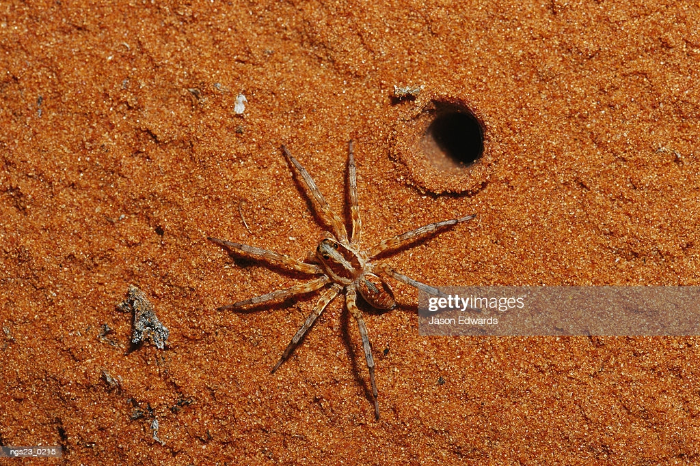

```{r setup, include=FALSE}
options(scipen = 1, digits = 2) #changes outputs to to decimal places.
knitr::opts_chunk$set(echo = TRUE)
packages_needed <- c("ggplot2", # graphics
                     "arm", # display() etc.
                     "ggfortify", # check model assumptions
                     "AICcmodavg", #average AIC models
                     "grid" #arrange objects
                     )
pk_to_install <- packages_needed [!( packages_needed %in% rownames(installed.packages())  )]
if(length(pk_to_install)>0 ){
  install.packages(pk_to_install,repos="http://cran.r-project.org")
}
#lapply(packages_needed, require, character.only = TRUE)
library(ggplot2)
library(arm)
library(ggfortify)
library(AICcmodavg)
library(grid)
```


As an example of simple logistic regression, Suzuki et al. (2006) measured sand grain size on 28 beaches in Japan and observed the presence or absence of the burrowing wolf spider *Lycosa ishikariana* on each beach. Sand grain size is the predictor variable and spider presence or absence is the response variable. If there is a relationship between the two variables, it would be sand grain size affecting spider occurrence, not the presence of spiders affecting the sand.

One goal of this study would be to determine whether there was a relationship between sand grain size and the presence or absence of the species, in hopes of understanding more about the biology of the spiders. Because this species is endangered, another goal would be to find an equation that would predict the probability of a wolf spider population surviving on a beach with a particular sand grain size, to help determine which beaches to reintroduce the spider to.

```{r import data}
library(readr)
spiders <- read_csv("../practice_examples/spiders.csv")
```

```{r plot, message=FALSE, warning=FALSE}
ggplot(spiders, aes(grainsize, status_binary)) +
  geom_point(size=3) +
  geom_smooth(method="glm", method.args=list(family="binomial"(link="logit"))) +
  labs(title="GLM, binomial count (presence/absence)") +
  ylab ("Probability of Occurrence") +
  xlab ("Sand Grain Size (mm)")
```

```{r model_grainsize}
model_spider <- glm(status_binary ~ grainsize, data=spiders, family=binomial)
model_spider
```

```{r check for overdispersion}
library(arm)
x <- predict(model_spider)
y <- resid(model_spider)
binnedplot(x, y)
```

The grey lines in the plot indicate ±2 standard errors, within which approximately 95% of the binned residuals are expected to fall.

```{r spider model coefficients}
coef(model_spider)
```

```{r spider model confidence intervals}
confint(model_spider)
```
Interpret the slope of the logistic regression. Dividing the slope coefficient by four will give us an approximate estimate for the maximum predicted effect on the response of a unit change in the predictor. Slope of grainsize variable is 5.1.
\
\
In this case, a difference in 1 unit of grain size (mm) corresponds to a increase in the probability of spider presence of 128% since 5.1/4 = 1.28. (*100 to convert to percent=128%). Notice the scale of grainsize; it is 0.24 to 1.24 mm.  

```{r model summary}
summary(model_spider)
```


